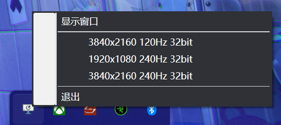

# WinResSelector

一款简洁的 Windows 分辨率快速切换小工具。

A sleek Windows resolution switcher utility.

## 🖼️ 预览 | Preview

## 🚀 开始使用 | Getting Started

1. 从 [Releases](https://github.com/fiko/WinResSelector/releases) 下载最新版本
2. 运行程序，添加您常用的分辨率配置
3. 可选择最小化到系统托盘，随时快速切换

Download the latest release, run the program, and add your frequently used resolution profiles. Optionally minimize to system tray for quick access.

## 📄 开源协议 | License

本项目基于 MIT 协议开源 - 查看 [LICENSE](LICENSE) 了解更多详情。

This project is licensed under the MIT License - see the [LICENSE](LICENSE) file for details.
